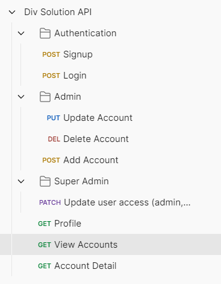

Div Solution API Documentation

# Div Solution API

## Overview

This API provides a robust solution for user authentication, account management, and role-based access control. Built with Flask and PostgreSQL, the API leverages JWT tokens for secure session handling and bcrypt for password hashing.

The API has three main sections:

1.  **Authentication** - Handles user signup and login.
2.  **Admin** - Allows admin users to add, update, view, and delete accounts.
3.  **Super Admin** - Allows super admin users to modify user roles and access levels.

## Project Structure

- **Flask**: A micro web framework used to set up the API.
- **PostgreSQL**: Database for storing user and account information.
- **JWT**: JSON Web Tokens for secure user authentication.
- **bcrypt**: Password hashing for secure storage of user credentials.

### Postman API Collection

Include the following image of the Postman collection structure for a visual reference to API endpoints.

## API Endpoints

### 1\. Authentication

#### POST /signup

**Description**: Registers a new user with a unique username and hashed password.

**Request Body**:

{
"username": "string",
"password": "string"
}

**Responses**:

- `201 Created`: User created successfully.
- `400 Bad Request`: Missing username or password, or username already exists.

#### POST /login

**Description**: Authenticates a user and provides a JWT token.

**Request Body**:

{
"username": "string",
"password": "string"
}

**Responses**:

- `200 OK`: Returns an access token.
- `401 Unauthorized`: Invalid credentials.

### 2\. Admin Endpoints

Admin users can manage accounts within the system.

#### POST /accounts

**Description**: Adds a new account under the current admin user.

**Request Body**:

{
"name": "string",
"email": "string",
"contact_number": "string"
}

**Responses**:

- `201 Created`: Account created successfully.
- `400 Bad Request`: Missing required fields.
- `409 Conflict`: Account with this email already exists.

#### PUT /accounts/<id>

**Description**: Updates an existing account's details.

**Request Body**:

{
"name": "string",
"email": "string",
"contact_number": "string"
}

**Responses**:

- `200 OK`: Account updated successfully.
- `404 Not Found`: Account not found.
- `409 Conflict`: Email already exists.

#### GET /accounts/<id>

**Description**: Retrieves details of a specific account.

**Responses**:

- `200 OK`: Returns account details.
- `404 Not Found`: Account not found.

#### DELETE /accounts/<id>

**Description**: Deletes a specific account (Admin only).

**Responses**:

- `200 OK`: Account deleted successfully.
- `404 Not Found`: Account not found.

### 3\. Super Admin Endpoint

#### PATCH /user/<id>

**Description**: Allows a super admin to update a user's role (Admin/Client).

**Headers**:

Authorization: Super Admin Key

**Request Body**:

{
"role": "admin" | "client"
}

**Responses**:

- `200 OK`: User role updated successfully.
- `403 Forbidden`: Unauthorized access.
- `400 Bad Request`: Invalid role.

## Additional Information

### JWT Authentication

JWT tokens are used to authenticate users and provide access to protected endpoints. After logging in, the user receives a token, which must be included in the headers (Authorization: Bearer <token>) for subsequent requests.

### Role-Based Access Control

The API supports role-based access control with two main roles:

- **Client**: Basic user with limited access.
- **Admin**: Can manage accounts within the system.
- **Super Admin**: Can update user roles and has higher privileges.

### Database Models

The database includes two main models:

- **User**: Contains fields for username, password, role, created_at, and updated_at.
- **Account**: Contains fields for name, email, contact number, added_by (referring to the admin who created the account), and created_at.
